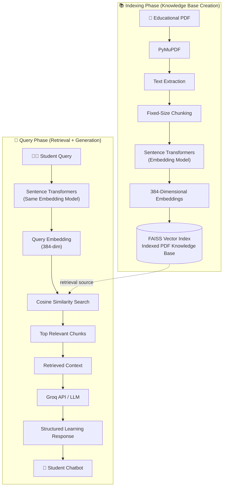
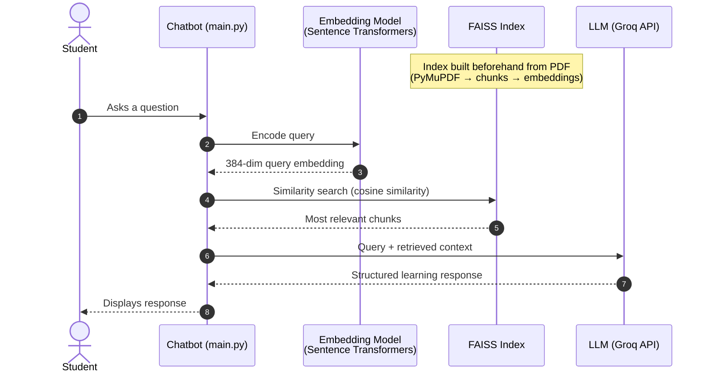

<div align="center">

# 🎓 AI Personalized Learning System

**An AI-powered Retrieval-Augmented Generation system for personalized, conversational learning using PDF-based educational content.**


</div>

---

## 📑 Table of Contents

1. [Overview](#1-overview)
2. [Problem Statement](#2-problem-statement)
3. [Solution](#3-solution)
4. [Key Features](#4-key-features)
5. [System Architecture](#5-system-architecture)
6. [End-to-End Workflow](#6-end-to-end-workflow)
7. [PDF Processing Pipeline](#7-pdf-processing-pipeline)
8. [Embedding and Vector Search](#8-embedding-and-vector-search)
9. [Query Processing Pipeline](#9-query-processing-pipeline)
10. [RAG Architecture](#10-rag-architecture)
11. [Structured LLM Response](#11-structured-llm-response)
12. [Technologies Used](#12-technologies-used)
13. [Project Structure](#13-project-structure)
14. [Installation](#14-installation)
15. [Configuration / Environment Variables](#15-configuration--environment-variables)
16. [How to Run](#16-how-to-run)
17. [Example User Interaction](#17-example-user-interaction)
18. [Example Workflow](#18-example-workflow)
19. [Advantages](#19-advantages)
20. [Limitations](#20-limitations)
21. [Future Enhancements](#21-future-enhancements)
22. [Security Considerations](#22-security-considerations)
23. [Author](#23-author)

---

## 1. Overview

**AI Personalized Learning System** is a conversational learning assistant that lets students ask questions about **courses, topics, learning paths, and educational concepts** through a chatbot interface.

The system is built on a **Retrieval-Augmented Generation (RAG)** architecture. Instead of relying only on the internal knowledge of a language model, it first retrieves the most relevant passages from an indexed educational knowledge base and then uses an LLM (via the **Groq API**) to generate a structured, learning-oriented response grounded in that retrieved context.

> ℹ️ **Note:** This project is a **RAG system**. It does **not** fine-tune or train any LLM. The embedding model and the LLM are used as pre-existing, off-the-shelf components.

The knowledge base is built from PDF documents containing educational content. The PDFs used as the data source were generated using an LLM and are processed by the application's ingestion pipeline.

---

## 2. Problem Statement

Students often face the following challenges when learning from course material:

- Educational content is spread across long documents that are time-consuming to search manually.
- Keyword search fails when the student's wording differs from the wording used in the material.
- General-purpose chatbots answer from their own training data and may not reflect the specific course content a student is working with.
- Students may not know which concepts to study first or how topics relate to one another within a learning path.

---

## 3. Solution

This project addresses these challenges by combining **semantic retrieval** with **LLM-based generation**:

1. Educational PDFs are converted into text, split into chunks, embedded as vectors, and stored in a **FAISS** index.
2. When a student asks a question, the question is embedded with the **same model** and matched against the indexed chunks by **semantic similarity**.
3. The most relevant chunks are passed to an LLM through the **Groq API**, which produces a **structured learning response** based on the retrieved context.

This keeps responses tied to the indexed knowledge base while still providing the natural-language fluency of an LLM.

---

## 4. Key Features

| Feature | Status | Description |
|---|---|---|
| PDF text extraction | ✅ Implemented | Extracts text from educational PDFs using PyMuPDF |
| Fixed-size chunking | ✅ Implemented | Splits extracted text into fixed-size chunks |
| Semantic embeddings | ✅ Implemented | Converts chunks and queries into 384-dimensional vectors using an open-source Sentence Transformers model from Hugging Face |
| Vector indexing | ✅ Implemented | Stores embeddings in a FAISS index for efficient similarity search |
| Cosine-similarity retrieval | ✅ Implemented | Retrieves the most semantically relevant chunks for a query |
| Retrieval-augmented generation | ✅ Implemented | Passes retrieved context to an LLM via the Groq API |
| Structured learning responses | ✅ Implemented | LLM generates organized, learning-oriented answers |
| Conversational chatbot interaction | ✅ Implemented | Students ask questions about courses, topics, and learning paths |

> Features that are **not** yet part of the system are listed separately under [Future Enhancements](#21-future-enhancements).

---

## 5. System Architecture

The system has two logical phases: an **indexing phase** (PDF → vector index) and a **query phase** (student question → structured response). The indexed PDF knowledge base serves as the retrieval source linking the two.



---

## 6. End-to-End Workflow



---

## 7. PDF Processing Pipeline

The ingestion pipeline converts raw PDF content into a searchable vector index.

| Step | Stage | Description |
|---|---|---|
| 1 | **PDF input** | A PDF containing educational/course content is provided as the knowledge source |
| 2 | **Text extraction** | **PyMuPDF** extracts text from the PDF |
| 3 | **Chunking** | Extracted text is divided into **fixed-size chunks** |
| 4 | **Embedding** | Each chunk is converted into a vector using a **Sentence Transformers** model |
| 5 | **Indexing** | The 384-dimensional embeddings are stored in a **FAISS** index |

**Why chunk the text?** Embedding models and LLM context windows work best with focused passages. Splitting the document into chunks lets the system retrieve only the parts relevant to a question rather than the entire document.

---

## 8. Embedding and Vector Search

### Why embeddings instead of keyword matching?

Keyword search only matches the literal words in a query. If a student asks *"What background do I need before starting X?"* but the document says *"Prerequisites for X include…"*, a keyword search may miss the passage entirely.

**Embeddings** map text into a high-dimensional numerical space where texts with similar *meaning* are positioned close together. This enables **semantic retrieval**: the system can surface conceptually related content even when the student's wording differs from the wording in the source document.

### Component roles

| Component | Role |
|---|---|
| **Embedding Model** (Sentence Transformers, Hugging Face) | Converts text (document chunks and user queries) into 384-dimensional numerical vectors |
| **FAISS** | Stores the vectors and performs efficient similarity search to retrieve the most relevant chunks |
| **LLM via Groq** | Uses the retrieved context to generate the final structured response |
| **RAG** | The overall approach that combines retrieval with LLM-based generation |

### Cosine similarity (conceptual)

Cosine similarity measures the **angle between two vectors**, not their length. Two vectors pointing in nearly the same direction have a cosine similarity close to 1, indicating similar meaning; vectors pointing in unrelated directions score lower. The system uses this measure to rank how semantically close each stored chunk is to the student's query.

### Role of FAISS

Comparing a query against every stored vector one by one becomes expensive as the knowledge base grows. **FAISS** (Facebook AI Similarity Search) is a library purpose-built for efficient similarity search over dense vectors, allowing the system to retrieve the closest chunks quickly.

### Why the same embedding model must be used for both chunks and queries

Embeddings are only comparable when they live in the **same vector space**. Different models produce different spaces, so a query vector from one model cannot be meaningfully compared with chunk vectors from another (and may even have a different dimensionality). Using the **same Sentence Transformers model** for both indexing and querying ensures that distances and similarity scores are meaningful.

---

## 9. Query Processing Pipeline

When a student submits a question:

1. **Receive** the student's query through the chatbot.
2. **Embed** the query using the same Sentence Transformers model used during indexing.
3. **Compare** the query embedding against the stored document embeddings.
4. **Measure** semantic similarity using **cosine similarity**.
5. **Retrieve** the most relevant chunks from the FAISS index.
6. **Pass** the retrieved context to the LLM.
7. **Generate** the final response through the **Groq API**.
8. **Return** a structured, learning-oriented response to the student.

---

## 10. RAG Architecture

```
User Query → Query Embedding → FAISS Similarity Search → Relevant Context → LLM → Structured Learning Response
```

**Retrieval-Augmented Generation (RAG)** separates *finding information* from *writing the answer*:

- **Retrieval stage:** The embedding model and FAISS locate the most relevant passages in the indexed knowledge base.
- **Generation stage:** The LLM is invoked **only after retrieval**, and receives the retrieved context to base its answer on.

Because the LLM is given retrieved context rather than being asked to answer purely from its internal knowledge, the response is grounded in the indexed educational content. This makes RAG a practical alternative to fine-tuning when the goal is to answer questions over a specific, updatable document set.

---

## 11. Structured LLM Response

After retrieval, the relevant chunks are provided to the LLM through the Groq API. The LLM is used to generate a **structured, learning-oriented response**, meaning the answer is organized in a way that is easy for a student to follow rather than returned as an unorganized block of text.

Conceptually, a structured learning response aims to present retrieved information in an organized form (for example, grouping related ideas and presenting them in a logical order). The exact layout is determined by the response-generation logic of the application and the LLM's output.

---

## 12. Technologies Used

| Category | Technology |
|---|---|
| Language | Python |
| PDF text extraction | PyMuPDF |
| Embeddings | Sentence Transformers (open-source Hugging Face model, 384-dimensional) |
| Vector database / index | FAISS |
| Similarity metric | Cosine similarity |
| LLM inference | Groq API |
| Core approach | Retrieval-Augmented Generation (RAG) |

---

## 13. Project Structure

```
.
├── data/              # Educational knowledge-source data (e.g., the PDF documents)
├── src/               # Application source code (core pipeline logic)
├── main.py            # Application entry point
├── requirements.txt   # Python dependencies
└── .gitignore         # Files and directories excluded from version control
```

| Path | Purpose |
|---|---|
| `data/` | Holds the data used by the system, such as the educational PDF knowledge source |
| `src/` | Contains the application's source modules supporting the processing and retrieval pipeline |
| `main.py` | Entry point used to run the application |
| `requirements.txt` | Lists the Python packages required to run the project |
| `.gitignore` | Prevents unwanted or sensitive files (such as local environment files) from being committed |

---

## 14. Installation

### Prerequisites

- Python 3.x
- `pip`
- A Groq API key

### Steps

```bash
# 1. Clone the repository
git clone <repository-url>
cd <repository-folder>

# 2. (Recommended) Create and activate a virtual environment
python -m venv venv
source venv/bin/activate        # Linux / macOS
# venv\Scripts\activate         # Windows

# 3. Install dependencies
pip install -r requirements.txt
```

---

## 15. Configuration / Environment Variables

The system uses the **Groq API** for response generation, which requires an API key. Configure it as an **environment variable** rather than hardcoding it in source code.

| Variable | Description |
|---|---|
| `GROQ_API_KEY` | Your Groq API key used to authenticate requests to the Groq API |

**Linux / macOS**

```bash
export GROQ_API_KEY=your_api_key_here
```

**Windows (PowerShell)**

```powershell
$env:GROQ_API_KEY="your_api_key_here"
```

> ⚠️ Replace `your_api_key_here` with your own key. **Never commit a real API key to version control.**

---

## 16. How to Run

After installing dependencies and setting `GROQ_API_KEY`, start the application from the repository root:

```bash
python main.py
```

---

## 17. Example User Interaction

> ⚠️ **Illustrative example only.** The following is a conceptual walkthrough of how the system processes a question. It is **not** a recorded output from the system.

**Student:**

```
What should I learn before studying topic X?
```

**What the system does:**

1. Converts the question into a 384-dimensional embedding.
2. Searches the FAISS index using semantic similarity.
3. Retrieves the most relevant educational chunks (for example, passages about prerequisites or foundational concepts related to topic X).
4. Sends the retrieved context, along with the question, to the LLM through the Groq API.
5. Generates a structured learning response based on that context.

---

## 18. Example Workflow

| Phase | Action | Component |
|---|---|---|
| **Setup** | Provide an educational PDF as the knowledge source | `data/` |
| **Setup** | Extract text from the PDF | PyMuPDF |
| **Setup** | Split text into fixed-size chunks | Chunking logic |
| **Setup** | Embed each chunk (384-dim) | Sentence Transformers |
| **Setup** | Store embeddings for search | FAISS |
| **Runtime** | Student submits a question | Chatbot |
| **Runtime** | Embed the question with the same model | Sentence Transformers |
| **Runtime** | Retrieve top relevant chunks via similarity search | FAISS |
| **Runtime** | Generate a structured response from retrieved context | LLM via Groq API |
| **Runtime** | Present the response to the student | Chatbot |

---

## 19. Advantages

- **Grounded responses:** Answers are based on retrieved content from the indexed knowledge base rather than only the LLM's internal knowledge.
- **Semantic understanding:** Retrieval matches meaning, not just exact keywords.
- **No model training required:** Uses a RAG approach, so the knowledge base can be changed by re-indexing documents rather than retraining a model.
- **Efficient search:** FAISS enables efficient similarity search over dense vectors.
- **Learning-oriented output:** Responses are generated in a structured format designed to be useful to students.
- **Modular design:** Separate stages (extraction, chunking, embedding, indexing, retrieval, generation) make the pipeline easier to understand and extend.

---

## 20. Limitations

- **Source quality dependence:** Answer quality depends on the quality and coverage of the source PDFs. The PDFs used here were LLM-generated, so any inaccuracies in them may carry through to responses.
- **Fixed-size chunking:** Fixed-size chunks may split related context across chunk boundaries.
- **Retrieval quality:** Retrieval depends on the quality of the embedding model and the similarity search.
- **Generation quality:** The generated answer depends on both the retrieved context and the behavior of the LLM.
- **Limited knowledge scope:** The system is limited to the content in the indexed knowledge base.
- **No formal evaluation yet:** Retrieval and generation quality have not been quantified with formal evaluation metrics.

---

## 21. Future Enhancements

> 🔮 The items below are **proposed future work**. They are **not** implemented in the current version.

| Area | Proposed Enhancement |
|---|---|
| Chunking | Semantic or adaptive chunking |
| Retrieval | Hybrid search combining keyword and vector search |
| Retrieval | Reranking of retrieved documents |
| Conversation | Conversation memory for multi-turn context |
| Personalization | User-specific learning profiles |
| Personalization | Learning progress tracking |
| Personalization | Personalized course recommendations |
| Personalization | Difficulty-level adaptation |
| Quality | Evaluation metrics for retrieval and generation |
| Transparency | Improved citation / source attribution |
| Interface | Web-based frontend |
| Platform | Authentication |
| Platform | Persistent student profiles |

---

## 22. Security Considerations

- **API key protection:** Store `GROQ_API_KEY` as an environment variable. Never hardcode it or commit it to the repository.
- **Version control hygiene:** Use `.gitignore` to exclude local environment files and other sensitive or unnecessary files.
- **Data transmission:** Retrieved context and student queries are sent to an external LLM provider (Groq API) for response generation. Avoid including sensitive or personal information in the knowledge base or in queries.
- **Key rotation:** If an API key is ever exposed, revoke and regenerate it immediately.
- **Future work:** Features such as authentication and persistent student profiles would introduce additional security requirements (access control, secure storage of user data) that would need to be addressed if implemented.

---

## 23. Author

**Your Name**

- GitHub: [@your-username](https://github.com/your-username)
- LinkedIn: [your-linkedin](https://linkedin.com/in/your-linkedin)
- Email: your.email@example.com

---

<div align="center">

*Built with Python, Sentence Transformers, FAISS, and the Groq API.*

</div>